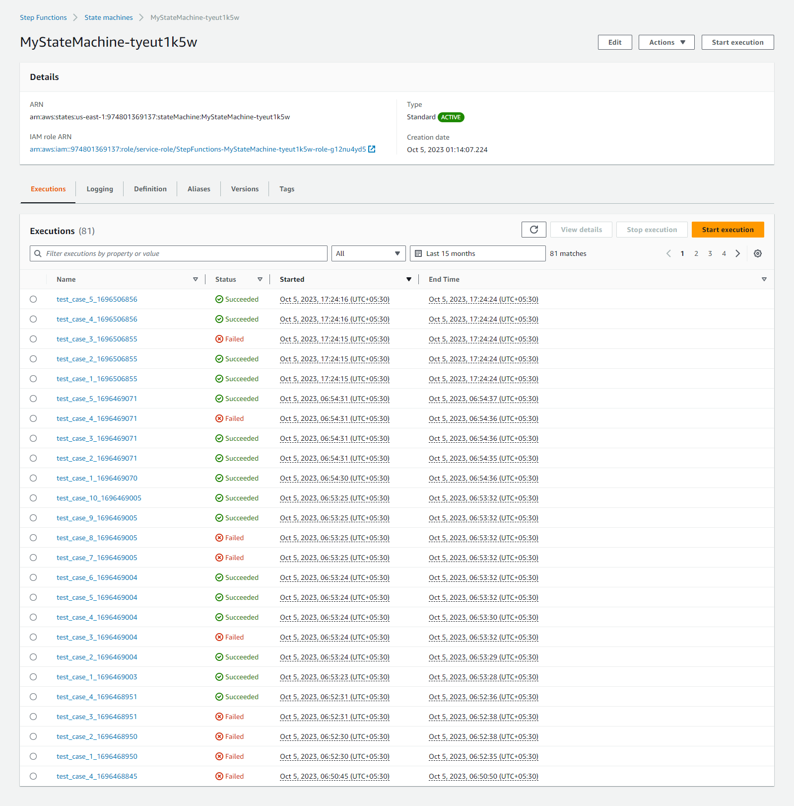

# Build-a-ML-Workflow-For-Scones-Unlimited-On-Amazon-SageMaker

# Table of Contents

1. [Project Overview](#project-overview)
2. [Project Steps Overview](#project-steps-overview)
3. [Prerequisites](#prerequisites)
4. [Data Staging](#data-staging)
   1. [Extracting the Data](#extracting-the-data)
   2. [Transforming the Data](#transforming-the-data)
   3. [Loading the Data into S3](#loading-the-data-into-s3)
5. [Model Training](#model-training)
   1. [Preparing Metadata](#preparing-metadata)
   2. [Training the Model](#training-the-model)
6. [Model Deployment and Monitoring](#model-deployment-and-monitoring)
   1. [Deploying the Model](#deploying-the-model)
   2. [Making Predictions](#making-predictions)
7. [Lambda Functions and Step Functions Workflow](#lambda-functions-and-step-functions-workflow)
8. [Build Your Custom Visualization](#build-your-custom-visualization)
9. [Image Gallery](#image-gallery)
10. [Conclusion](#conclusion)

## Project Overview

- Image Classifiers are used in the field of computer vision to identify the content of an image and it is used across a broad variety of industries, from advanced technologies like autonomous vehicles and augmented reality, to eCommerce platforms, and even in diagnostic medicine.

- You are hired as a Machine Learning Engineer for a scone-delivery-focused logistics company, Scones Unlimited, and you’re working to ship an Image Classification model. The image classification model can help the team in a variety of ways in their operating environment: detecting people and vehicles in video feeds from roadways, better support routing for their engagement on social media, detecting defects in their scones, and many more!

- In this project, you'll be building an image classification model that can automatically detect which kind of vehicle delivery drivers have, in order to route them to the correct loading bay and orders. Assigning delivery professionals who have a bicycle to nearby orders and giving motorcyclists orders that are farther can help Scones Unlimited optimize their operations.

- As an MLE, your goal is to ship a scalable and safe model. Once your model becomes available to other teams on-demand, it’s important that your model can scale to meet demand, and that safeguards are in place to monitor and control for drift or degraded performance.

- In this project, you’ll use AWS Sagemaker to build an image classification model that can tell bicycles apart from motorcycles. You'll deploy your model, use AWS Lambda functions to build supporting services, and AWS Step Functions to compose your model and services into an event-driven application. At the end of this project, you will have created a portfolio-ready demo that showcases your ability to build and compose scalable, ML-enabled, AWS applications.

## Project Steps Overview

- Step 1: Data staging
- Step 2: Model training and deployment
- Step 3: Lambdas and step function workflow
  - You're going to write and deploy three Lambda functions, and then use the Step Functions visual editor to chain them together!
  - The first lambda function is responsible for data generation. The second one is responsible for image classification. And the third function is responsible for filtering out low-confidence inferences.
- Step 4: Testing and evaluation
- Step 5: Optional challenge
- Step 6: Cleanup cloud resources

## Project Environment

- Sagemaker Studio
  - Click through the AWS console to Amazon Sagemaker.
  - Click through the main Sagemaker page to Amazon Sagemaker Studio from the left hand toolbar.
  - If a user does not exist already in the Sagemaker Studio Control Panel, Add user.
  - Select an execution role that has full Sagemaker Access, otherwise you can create a new role.
  - Create a role and proceed with creating the user.
- Lambda Functions
  - You need the Lambda service to complete the project. At this point, you should have already created and deployed a few lambda functions at this point.
  - In case you want to test it again:
    - Proceed to open up the AWS console from the AWS Gateway.
    - Click through the AWS console to Amazon Lambda.
    - Click to create a lambda function.
    - Test the lambda function is working
- Step Function Visual Editor
  - You should have access to the step function visual editor. If you want to double-check: - Proceed to open up the AWS console from the AWS Gateway. - Click through the AWS console to Step Function. - Click to create a state machine. - Choose to design your workflow visually - Create a simple Step function
    This README provides an overview of the process we followed to deploy and monitor a machine learning workflow for image classification using AWS SageMaker. The project consists of several key steps:

### Prerequisites

Before getting started, ensure that we have the following prerequisites:

- AWS credentials properly configured.
- A SageMaker notebook instance, using the Python 3 (Data Science) kernel, preferably an ml.t3.medium instance.

### Data Staging

#### 1. Extracting the Data

To work with the CIFAR-100 dataset, we first need to extract it from a hosting service. I've written a Python function `extract_cifar_data` to fetch and store the dataset as a gzipped file. You can test this function to ensure that it successfully creates the `cifar.tar.gz` file.

#### 2. Transforming the Data

The extracted CIFAR dataset is in a compressed format. We use the `tarfile` library to decompress it. Once decompressed, we have access to the training and testing data in the form of pickle files. We load these files and reshape the data to obtain individual images. Additionally, we filter the dataset to include only bicycles and motorcycles.

#### 3. Loading the Data into S3

The filtered data is uploaded to an S3 bucket. The SageMaker session is used to get the default S3 bucket, AWS region, and execution role, which are essential for data uploads. We employ the `aws s3 sync` command to upload the data to the specified S3 bucket.

### Model Training

#### 4. Preparing Metadata

For image classification, metadata in the form of TSV (Tab-Separated Values) files is required. These files contain labels and file paths. We've written a `to_metadata_file` function to generate and upload these metadata files to S3.

#### 5. Training the Model

We train the image classification model using SageMaker. The model is configured with hyperparameters such as image shape, number of classes, and training samples. It is trained using the training and validation data stored in the S3 bucket. The model's performance is monitored, and it is saved to the specified S3 location.

### Model Deployment and Monitoring

#### 6. Deploying the Model

The trained model is deployed on a SageMaker endpoint with a specific instance type. Data capture is enabled to monitor the model's inputs and outputs. The endpoint is used for making predictions.

#### 7. Making Predictions

A predictor is instantiated to process image data and obtain predictions from the deployed model. Images are prepared, serialized, and sent to the endpoint for inference. The predictions are returned as probabilities for each class.

This covers the initial steps of deploying and monitoring an image classification workflow. Further enhancements and improvements can be made to the workflow, such as data augmentation, gathering more training samples, and refining the model for better accuracy.

To monitor the deployed model, we can explore the `data_capture` directory in the S3 bucket, which contains valuable data about the model's inputs and outputs over time.

## Lambda Functions and Step Functions Workflow

The following section outlines the next phase of our project, which involves creating Lambda functions and configuring a Step Functions workflow.

1. **Lambda Functions:** We are in the process of creating three Lambda functions. The first Lambda function, "serializeImageData," is responsible for copying an object from S3, base64 encoding it, and returning it as image data. The second Lambda function is intended for classification, where we decode the image data and make predictions using a SageMaker model. The third Lambda function filters low-confidence inferences based on a specified threshold.

2. **Step Functions Workflow:** Utilizing the Step Functions visual editor, we will design a workflow that chains these Lambda functions together. The workflow involves invoking the Lambda functions in the appropriate sequence and applying filtering to inputs and outputs.

3. **Testing and Evaluation:** Our code includes provisions for generating test cases for our Step Functions workflow. Furthermore, we are downloading captured data from SageMaker Model Monitor and visualizing the inferences. This includes setting a confidence threshold for production use.

## Build Your Custom Visualization

This section of the notebook includes a variety of functions and components, each tailored to specific tasks within our event-driven ML workflow. Below, we provide a comprehensive summary of each element:

### Visualization Function (`visualize_data_bar_chart`):

- Creates a bar chart to visualize confidence scores over time.
- Utilizes Matplotlib for data visualization.
- Takes a JSON data object as input, extracts pertinent information, and generates a bar chart.

### Test Case Generation Function (`generate_test_case`):

- Generates a random test case for the workflow.
- Selects an S3 object key from the "test" folder within an S3 bucket.

### List Execution Timestamps Function (`list_execution_timestamps`):

- Lists execution timestamps of a Step Function.
- Queries AWS Step Functions to retrieve execution timestamps of a specified state machine.

### Local Capture Data Functions (`clear_local_capture_data`, `create_captured_data_directory`):

- `clear_local_capture_data` function clears the local capture data folder if it exists.
- `create_captured_data_directory` function creates the "captured_data" directory if it doesn't already exist.

### Download Data Function (`download_data_for_timestamp`):

- Downloads captured data from an S3 bucket to a designated local destination directory.

### Run Step Function Multiple Times Function (`run_step_function_multiple_times`):

- Executes a specified Step Function multiple times with various test cases.
- Utilizes the AWS Step Functions client to initiate executions.

### Main Workflow Function (`run_inference_workflow`):

- Orchestrates the complete workflow for capturing, processing, and visualizing inference data.
- Clears local capture data, generates timestamps from Step Function executions, runs the Step Function multiple times with different test cases, downloads the captured data, and ultimately visualizes it using the `visualize_data_bar_chart` function.

### Example Usage:

- Offers an example illustrating how to utilize the `run_inference_workflow` function by specifying essential parameters such as the S3 bucket name, the number of runs, the Step Function ARN, and the number of executions to consider for data retrieval.

### Visualization of Captured Data:

- Following the execution of the Step Function, the script loads captured data, extracts pertinent information, and presents it visually.
- The visualization includes images alongside their corresponding inference results, encompassing the predicted class and confidence scores, all subject to a specified production-use threshold.

# Image Gallery

Below are images related to this project:

## EndpointsAmazonSageMaker.png

- Screenshot of Amazon SageMaker endpoints configuration.

## Error_StepFunction.png

- Error encountered in a Step Function workflow.

## Event_StepFunction.png

- Visual representation of an event in a Step Function workflow.

## Executions_test_case_5_1696506856_Stepfunction.png

- Execution details in a Step Function workflow.

## GraphView_Stepfunction.png

- Graphical view of a Step Function workflow.

## lambda functions.png

- Overview of AWS Lambda functions.

## LambdaFunction_1_serializeImageData.png

- Lambda function for serializing image data.

## LambdaFunction_2_image-classification-py39.png

- Lambda function for image classification.

## LambdaFunction_3_THRESHOLD_CONFIDENCE.png

- Lambda function for applying threshold confidence.

## ModelsAmazonSageMaker.png

- Models in Amazon SageMaker.

## Sagemaker_IAM_Roles.png

- IAM roles configuration for Amazon SageMaker.

## StepFunctionsExecutions.png

- Executions in AWS Step Functions.

## StepFunctions_StartExecution.png

- Starting execution in AWS Step Functions.

## TrainingJobsAmazonSageMaker.png

- Training jobs in Amazon SageMaker.

## ConfidenceScoreOverTime.png

- Graph showing confidence scores over time.

## ModelPredictionOutput.png

- Output of model predictions.

## ModelPredictionOutput1.png

- Another view of model prediction output.

## stepfunction.jpeg

- A visual representation of an AWS Step Function.

## Conclusion

Congratulations!

We've successfully reached the conclusion of this project, where we've built an event-driven ML workflow that seamlessly integrates into the Scones Unlimited production architecture. Throughout this journey, we harnessed the SageMaker Estimator API to deploy our SageMaker Model and Endpoint. Moreover, AWS Lambda and Step Functions were employed to orchestrate the ML workflow. Notably, we utilized SageMaker Model Monitor to instrument and monitor our
